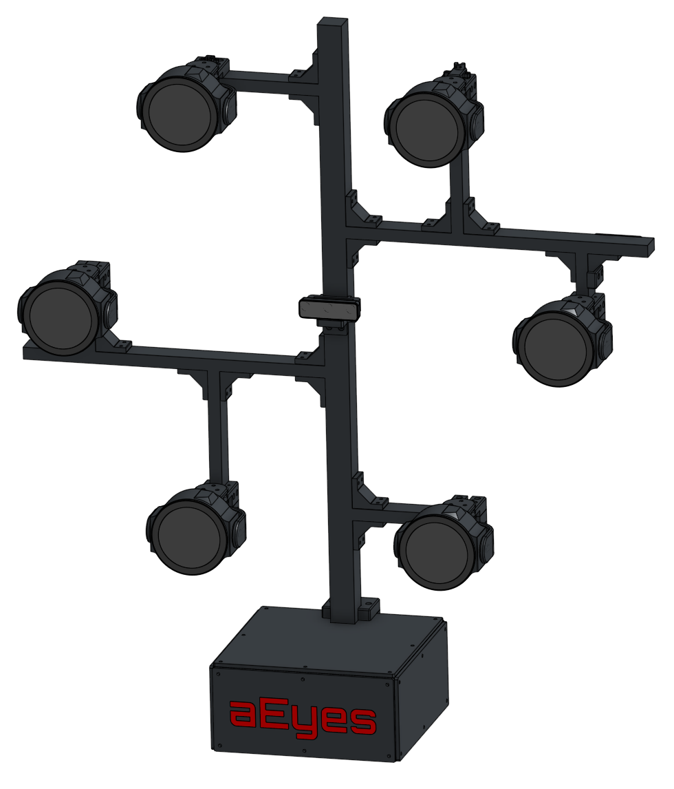
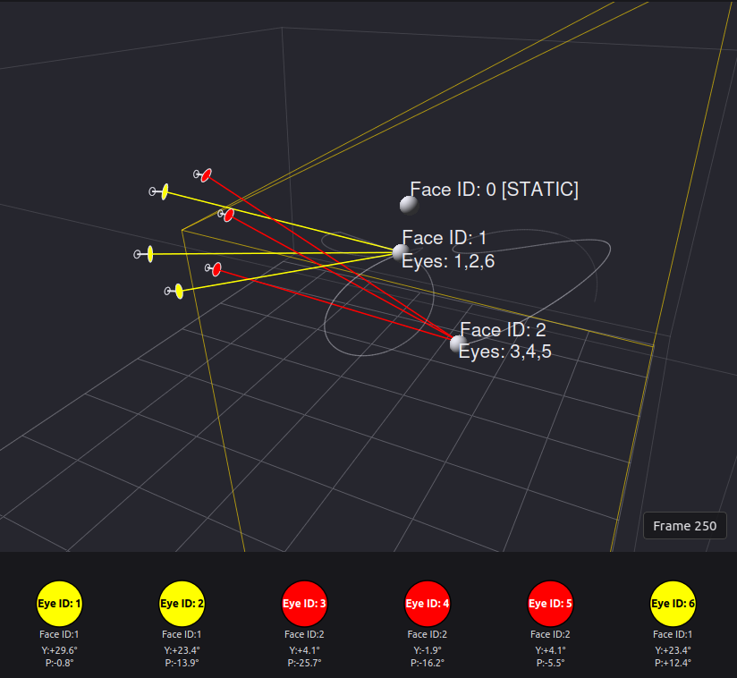
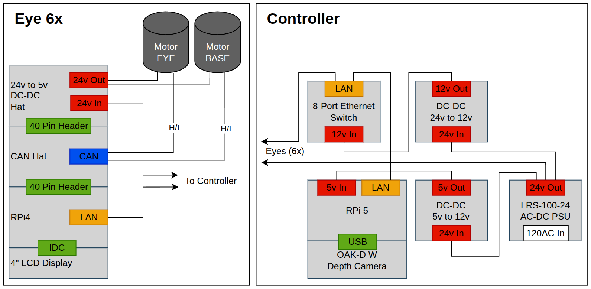
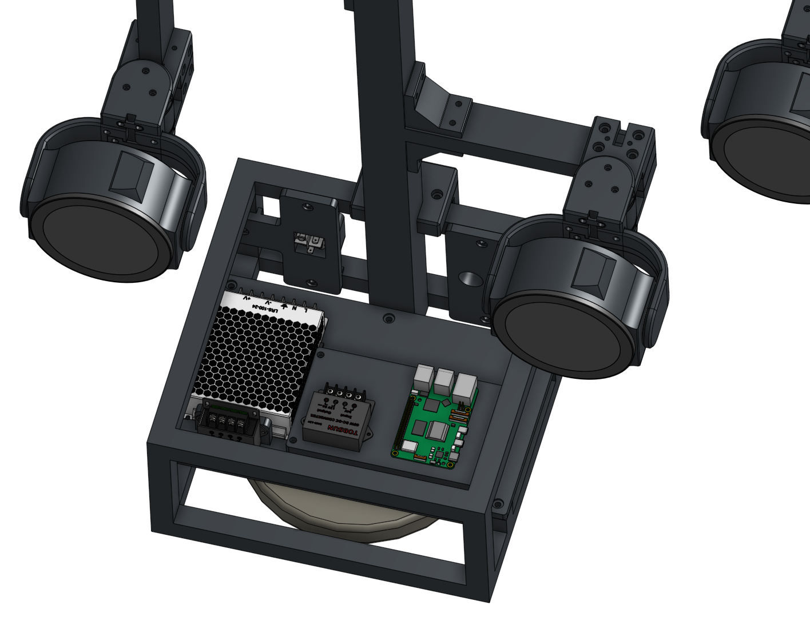

# aEyes

A distributed robotic eye system. A central controller detects and tracks faces using a depth camera, then broadcasts motor and render commands to 6 Raspberry Pi eye units over a wired network. Each eye unit renders a procedurally animated OpenGL iris and drives two CAN-bus gimbal motors to follow tracked faces.



## Simulation



The controller includes a demo mode (`controller/demo.py`) that replaces the camera and face detector with synthetic 3D face positions — no hardware required. Several scripted faces move through the scene on sinusoidal paths, appearing and disappearing over time to exercise the tracker and eye assignment logic.

The demo runs the full pipeline: face tracking → eye assignment → gimbal angle computation → ZMQ publish. If physical eye units are connected, they respond as normal. A **PySide6 + pyqtgraph** GUI shows a live 3D visualization of tracked face positions, eye positions, and the assignment lines between them.

There is also a standalone eye renderer demo (`eye/demo.py`) that animates the iris directly — cycling iris color, pulsing radius, blinking, and rotating — without ZMQ or motors. Useful for testing the display and shader in isolation.

To run the controller demo:
```bash
cd ~/aEyes/controller
source .venv/bin/activate
python3 demo.py
```

To run the eye renderer demo:
```bash
cd ~/aEyes/eye
source .venv/bin/activate
python3 demo.py
```

---

## Pipeline

The system runs a continuous loop split across the controller and each eye unit.

**1. Capture** — The OAK-D camera produces synchronized RGB and depth frames. The controller reads these at up to 60 fps.

**2. Detection** — A face detector runs inference on each RGB frame and outputs bounding boxes. Each detection is back-projected through the depth map to produce a 3D position in camera space (`Position3D`: x forward, y left, z up).

**3. Tracking** — `face_tracker.py` maintains a set of live tracks using a **3D Kalman filter** (constant-velocity model) per face and **Hungarian algorithm** matching between detections and existing tracks. Tracks are confirmed after a minimum number of consecutive hits and survive brief occlusions. A re-ID window allows lost tracks to be reacquired if a face reappears nearby within a short time.

**4. Assignment** — `eye_assigner.py` maps confirmed face tracks to eye IDs (1–6) by proximity. Multiple eyes can follow the same face if there are fewer faces than eyes. Assignments are rate-limited to avoid thrashing.

**5. Eye state** — `eye_manager.py` maintains a render state per eye: iris color (lerped toward a per-face color on assignment, back to neutral on loss), blink animation, eyelid position, and iris radius. It also calls `conversions.py` to transform each face's 3D position through the physical geometry of that eye's gimbal, producing **yaw** and **pitch** angles.

**6. Publish** — `publisher.py` serializes all 6 `ControlMessage` structs as JSON and broadcasts them over a **ZMQ PUB** socket on port 9000 at 15 Hz. Each message carries render parameters (iris color, radius, eyelid, cat-eye flag) and motor targets (yaw, pitch).

**7. Receive & render** — Each Raspberry Pi subscribes to the ZMQ feed and filters for its own `EYE_ID`. On each message the Pi updates the OpenGL renderer — iris color, radius, eyelid, rotation — which redraws at 60 fps via `eye_renderer.py` and the GLSL fragment shader (`eye.frag`). The shader draws a procedural iris using fractal Brownian motion (FBM), striations, eyelid masking, cat-eye slit, and a vignette.

**8. Motor control** — Concurrently, a CAN worker thread runs at 100 Hz. Motor targets are ramped toward the received yaw/pitch using a speed profile that slows down for large moves and speeds up close to the target. Final angles are sent as position commands to the two MG4010E motors over the CAN bus.

---

## System Architecture



The system is split into two subsystems: a **Controller** and **6 Eye units**, all connected over a wired Ethernet network.

### Controller

The controller is built around a **Raspberry Pi 5** running the face detection and tracking pipeline. An **OAK-D depth camera** connects via USB, providing RGB and depth frames. Faces are detected, tracked in 3D, and assigned to eyes. The controller then publishes motor angle and render commands to all 6 eyes at 15 Hz over ZMQ.

Power is supplied by a **Mean Well LRS-100-24** AC/DC PSU (120V AC in, 24V DC out). A DC-DC converter steps the 24V rail down to 12V for the Ethernet switch and other 12V loads. An **8-port Ethernet switch** connects the controller to all 6 eye units on a dedicated wired LAN (`192.168.5.x`).

### Eye Units (×6)

Each eye unit runs on a **Raspberry Pi 4B**. A **Waveshare RS485/CAN Hat** stacks onto the Pi's GPIO header and provides the CAN bus interface to the two gimbal motors. A **Waveshare 4" DSI LCD** (1920×480, rotated 90°) is connected via IDC and renders the animated iris at 60 fps using OpenGL ES.

Power enters each eye unit at 24V from the shared rail. An onboard **24V-to-5V DC-DC converter** hat powers the Raspberry Pi. The 24V rail feeds the motors directly.

Each eye has two **MG4010E-i10v3 CAN servo motors**:
- **Motor BASE** (CAN ID 1) — yaw axis
- **Motor EYE** (CAN ID 2) — pitch axis

The Pi receives a `ControlMessage` over ZMQ, ramps the motor targets smoothly, issues CAN position commands at 100 Hz, and renders the iris in sync.

---

## Hardware

**Controller**
- Raspberry Pi 5
- OAK-D depth camera (USB)
- Mean Well LRS-100-24 AC/DC PSU (24V)
- DC-DC converter 24V → 12V
- 8-port Ethernet switch

**Eye units (×6)**
- Raspberry Pi 4B (4GB)
- Waveshare 4" DSI LCD (1920×480)
- Waveshare RS485/CAN Hat
- DC-DC converter hat 24V → 5V
- 2× MG4010E-i10v3 CAN servo motors (yaw + pitch, 1:10 gearbox)



---

## Setup

- [Controller setup](controller/README.md) — OS, camera, dependencies, network
- [Eye unit setup](eye/README.md) — Raspberry Pi OS, install script, motor zeroing, SD card cloning
- [Docs](docs/README.md) — Additional documentation

---

## AI Disclosure

Portions of this codebase were written with the assistance of **Claude Code** (Anthropic). AI assistance was used primarily for software development — including pipeline architecture, tracking algorithms, motor control logic, the OpenGL shader, and ZMQ communication.

The physical hardware design, mechanical assembly, electronics wiring, and overall creative vision were entirely human work. The concept, aesthetic, and engineering decisions that define aEyes as a project were conceived and executed by the author.

---

## After Thoughts

Use physical endstops for both motors which removes the need for zeroing.