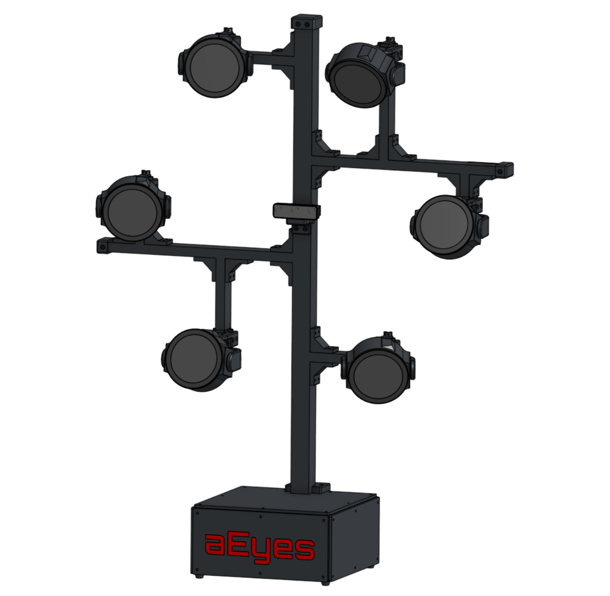
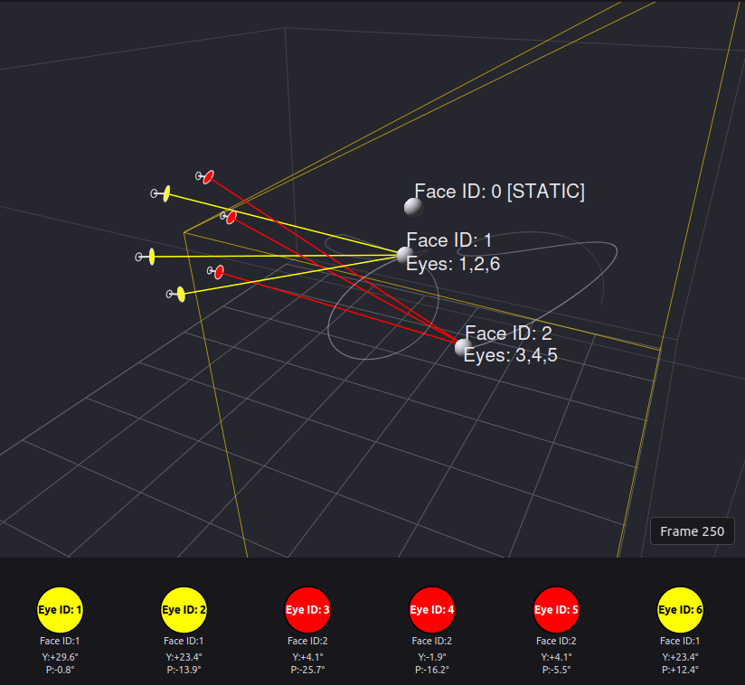
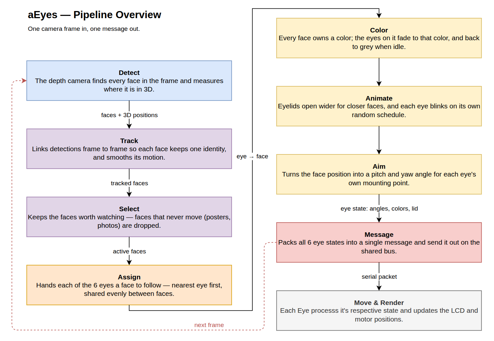
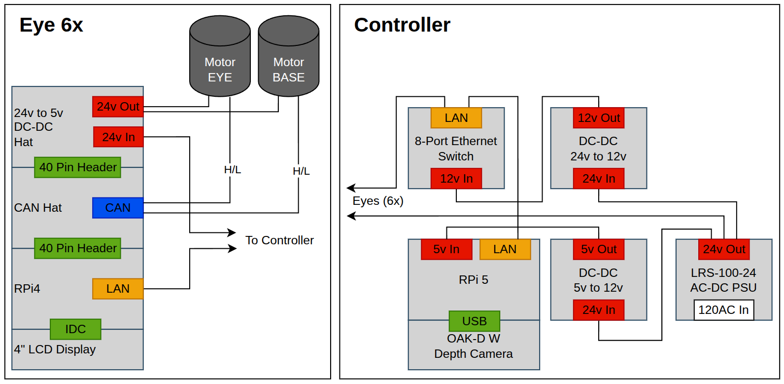
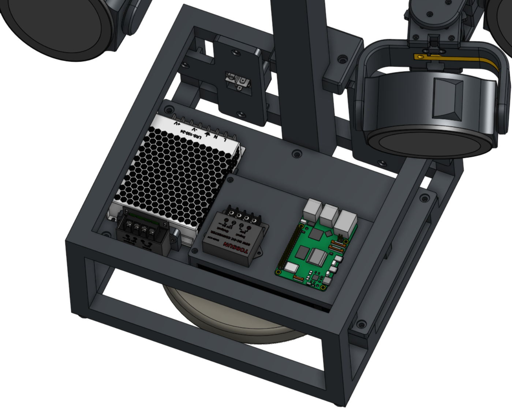

# aEyes

aEyes is a robotic face tracker with a set of six eyes tracking faces as they traverse the scene.

** Work in progress **

# Simulation

The simulation (using PySide6 + pyqtgraph GUI) generates face positions moving through 3-space with some faces disappearing completely, disappearing and reappearing, or staying static. These faces are then sent through the face tracking, assignment, and eye manager pipeline to generate yaw and pitch of the indivdual eyes. 

# Pipeline

The pipeline is fairly straight forward and the major parts are: **AI Camera Interface → Face Tracker → Eye Manager → Message Publisher → RPi/LCD/Motors**

<figure>
  
  <figcaption align="center">Pipeline Simplified.</figcaption>
</figure>

# System

The system is split into two subsystems: a **Controller** and **6 Eye units**, all connected over a wired Ethernet network.

# Hardware

**Controller**
- Raspberry Pi 5
- OAK-D depth camera (USB)
- Mean Well LRS-100-24 AC/DC PSU (24V)
- DC-DC converter 24V → 12V
- 8-port Ethernet switch

**Eye units (×6)**
- Raspberry Pi 4B
- Waveshare 4" DSI LCD
- Waveshare RS485/CAN Hat
- DC-DC converter hat 24V → 5V
- 1× MG4010E-i10v3 CAN servo motor (yaw)
- 1× MG4005-v2 CAN servo motor (pitch)

# Setup

There are several README's through out the repository for indivdual systems:

- [Controller](controller/README.md)
- [Eye](eye/README.md)
- [Extra Docs](docs/README.md)

# AI Disclosure

Project concept, aesthetic, engineering design, and original code base were conceived and executed by the author.

Portions of this codebase were reviewed, revised, and written with the assistance of Claude Code (Anthropic).
